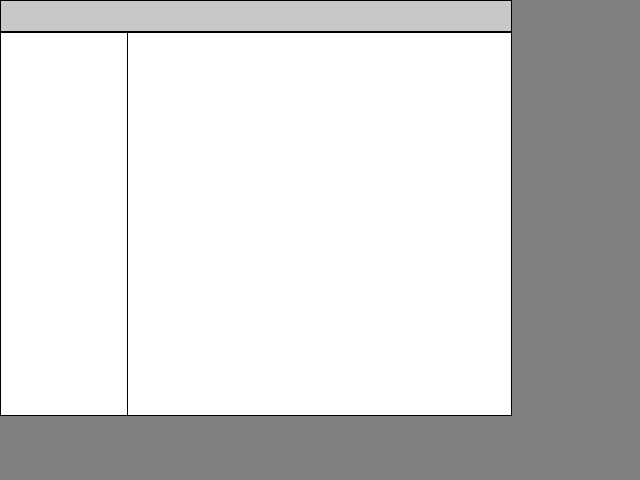

# cydp

this is an experimental project. it does not work yet. i will take this project
seriously once i can get sdl2 to work under drm/kms. it is supposed to be a
display server that communicates with clients with a widget based protocol. if
you take a quick look at the source code youll see that the protocol part does
not exist yet.

requires SDL2, a c compiler, and make.
