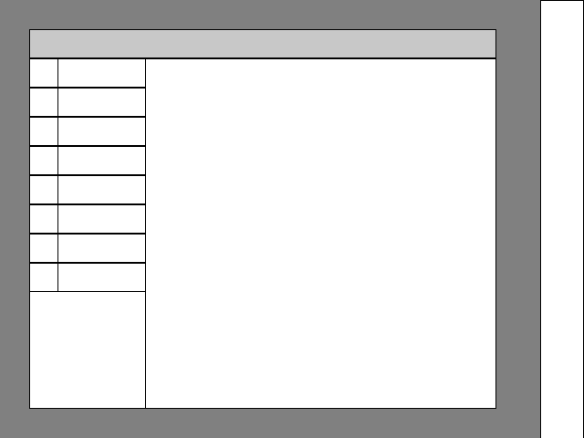

# cydp

this is an experimental project. it does not work yet. i will take this project
seriously once i can get sdl2 to work under drm/kms. it is supposed to be a
display server that communicates with clients with a widget based protocol. if
you take a quick look at the source code youll see that the protocol part does
not exist yet.

it has a minimalist dom-like hierarchy of elements that programs will be able to
interact with over a socket. the design goal for this is to allow UI elements
and their semantic purposes to be defined client side, leaving styling,
rendering, animations, etc to be entirely server side. though almost entirely
pointless, it will be easy to create programs that interface with this server,
and the end user will not need to worry about their preferences breaking an
application's interface.

requires SDL2, a c compiler, and make.
